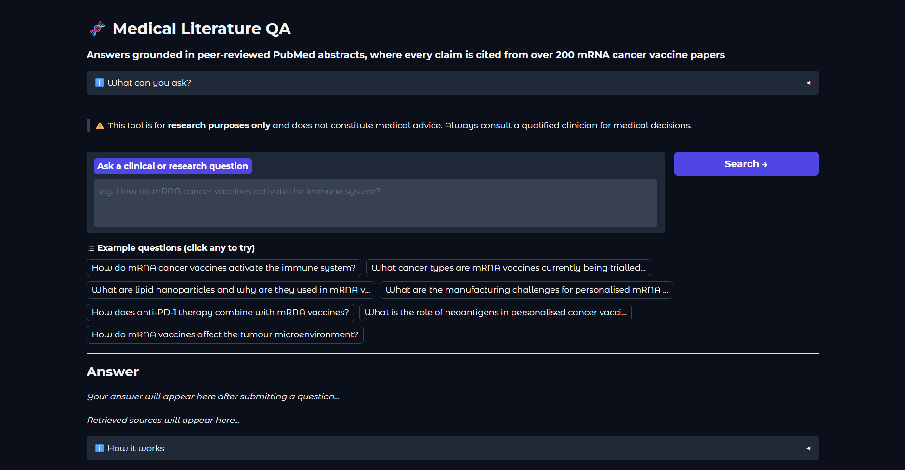

# 🧬 Medical Literature QA RAG System

A RAG pipeline that answers clinical and research questions grounded in peer-reviewed PubMed abstracts on mRNA cancer vaccines and immunotherapy. Every answer is cited with links back to the original papers.

---

## Demo



**Example questions to try:**

- How do mRNA cancer vaccines activate the immune system?
- What cancer types are mRNA vaccines currently being trialled for?
- What are lipid nanoparticles and why are they used in mRNA vaccines?
- How does anti-PD-1 therapy combine with mRNA vaccines?
- What are the manufacturing challenges for personalised mRNA cancer vaccines?

---

## Architecture

```
User question
      │
      ▼
Embed query          ← all-MiniLM-L6-v2 (sentence-transformers, local)
      │
      ▼
Vector search        ← ChromaDB (cosine similarity, top-10 retrieved)
      │
      ▼
Deduplicate          ← by PMID, keep top-5 unique papers
      │
      ▼
Build prompt         ← numbered sources + instruction to cite sources
      │
      ▼
LLM generation       ← Llama 3.1 8B / Llama 3.3 70B (temperature=0.1)
      │
      ▼
Cited answer + sources displayed in Gradio UI
```

**Offline indexing pipeline (run once):**

```
PubMed API (esearch + efetch)
      │
      ▼
Parse XML            ← title, abstract, year, journal, PMID
      │
      ▼
Chunk text           ← 150-word chunks, 20-word overlap, title prepended
      │
      ▼
Embed chunks         ← all-MiniLM-L6-v2, batch_size=32
      │
      ▼
Store in ChromaDB    ← PersistentClient, cosine distance, metadata preserved
```

---

## Tech Stack

| Component       | Tool                                      | Why                                                          |
| --------------- | ----------------------------------------- | ------------------------------------------------------------ |
| Data source     | PubMed E-utilities API                    | Free Public Access, No key needed, 35M+ peer-reviewed papers |
| Embedding model | all-MiniLM-L6-v2                          | Local, 80MB, 384-dim vectors                                 |
| Vector database | ChromaDB                                  | Local, persistent, no server needed                          |
| LLM             | Llama 3.1 8B & Llama 3.3 70B via Groq API | -                                                            |
| UI              | Gradio                                    | ML-native demo interface, shareable links                    |
| Language        | Python 3.11                               | -                                                            |

All components are free and open source. Zero API costs for indexing. LLM inference via Groq free tier.

---

## Evaluation

Evaluated across **30 questions** spanning core domain (mRNA cancer vaccines) and boundary cases (adjacent COVID-19 immunology, vaccine hesitancy, non-cancer mRNA applications). Boundary cases intentionally included to measure honest system performance rather than cherry-picked scores.

### Embedding-based evaluation (all 30 questions)

| Metric            | All 30 questions | Core domain (17 questions) | Off-domain (6 questions) |
| ----------------- | ---------------- | -------------------------- | ------------------------ |
| Answer relevancy  | 0.779            | 0.879                      | 0.557                    |
| Context relevance | 0.653            | 0.686                      | NA                       |
| Groundedness      | 0.782            | 0.797                      | NA                       |

**Metric definitions:**

- **Answer relevancy :** cosine similarity between question vector and answer vector. Measures whether the answer is on-topic.
- **Context relevance :** cosine similarity between question vector and retrieved chunk vectors. Measures retrieval quality.
- **Groundedness :** cosine similarity between answer vector and ground truth vector. Approximates factual correctness.

**Interpretation:** The drop in off-domain scores (0.879 → 0.557 answer relevancy) reflects honest retrieval boundaries as the system correctly returns lower-confidence answers for topics outside the indexed corpus rather than hallucinating confident responses. This is the intended behaviour for a grounded QA system.

---

## Quickstart

### Prerequisites

- Python 3.10+
- Free Groq API key from [console.groq.com](https://console.groq.com)

### Setup

```bash
# 1. Clone the repo
git clone https://github.com/Shivank19/medical-lit-rag.git
cd medical-lit-rag

# 2. Create and activate virtual environment
python -m venv .venv
source .venv/bin/activate        # Mac/Linux
.venv\Scripts\activate           # Windows

# 3. Install dependencies
pip install -r requirements.txt

# 4. Add your Groq API key to .env
GROQ_API_KEY="your_key_here"
```

### Build the index (run once)

```bash
python app/fetch.py      # fetch 200 PubMed abstracts → data/abstracts.json
python app/chunk.py      # chunk abstracts → data/chunks.json
python app/embed.py      # embed + index in ChromaDB → embeddings/
```

Embedding takes 3–5 minutes on CPU. Only needs to run once as ChromaDB persists to disk.

### Launch the UI

```bash
gradio app/ui.py
```

Opens at `http://localhost:7860`. Add `demo.launch(share=True)` in `ui.py` for a public link.

### Run evaluation

```bash
python app/eval.py
```

Outputs scores to `evaluation/scores.json`.

---

## Design Decisions

**Why chunk at 150 words with 20-word overlap?**

`all-MiniLM-L6-v2` has a 256-token (~180 word) limit. 150 words stays safely under the limit while being large enough to contain a complete idea. 20-word overlap prevents context loss at chunk boundaries.

**Why prepend the title to each chunk?**

A chunk like "side effects were reported in 24% of patients" carries no context about which drug or study. Prepending the paper title makes every chunk self-identifying, improving retrieval precision significantly.

**Why deduplicate by PMID after retrieving 10 chunks?**

Retrieving 10 and deduplicating to 5 unique papers ensures the top-5 sources in the prompt come from 5 different papers. Without this, a single highly-relevant paper can occupy multiple slots, wasting citation space.

**Why not use LangChain?**

The pipeline was built from scratch to understand each component: embedding, vector search, prompt construction, LLM call as separate, testable pieces. LangChain would abstract away exactly the layers that matter for learning and debugging.

**Why temperature=0.1?**
Medical QA requires factual precision over creativity. Low temperature keeps the LLM close to the source text and reduces hallucination beyond what the retrieved chunks say.

---

## Future Improvements

- [ ] Swap `all-MiniLM-L6-v2` for `BioBERT` and compare RAGAS scores
- [ ] Dynamic domain selection: user picks specialty, system fetches and indexes on demand
- [ ] Confidence threshold: return "insufficient information" when retrieval scores fall below 0.55
- [ ] Reranking step between retrieval and generation using a cross-encoder model
- [ ] Full-text indexing via PubMed Central Open Access subset
- [ ] RAGAS evaluation with claim-level faithfulness scoring

---

## License

MIT

---

_Built as a project to demonstrate RAG system design, vector database usage, and LLM evaluation methodology._
